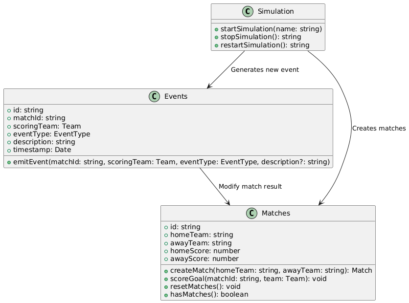

# Football Match Simulation API (NestJS, TypeScript, GraphQL)

This project is a football match simulation API built using [NestJS](https://nestjs.com/), [TypeScript](https://www.typescriptlang.org/), and [GraphQL](https://graphql.org/). It allows users to simulate football matches, view match results, and track live match result in real-time via GraphQL queries, mutations, and subscriptions.


## Table of Contents

- [Architecture](#architecture)
- [Installation](#installation)
- [Running the Project](#running-the-project)
- [Testing](#testing)
- [GraphQL Playground](#graphql-playground)
- [GraphQL Examples](#graphql-examples)
  - [Queries](#queries)
  - [Mutations](#mutations)
  - [Subscriptions](#subscriptions)

---

## Architecture

 


## Installation

To get started, clone the repository and install the dependencies:

```bash
npm install
```

## Running the Project

To start the project in development mode, run the following command:

```bash
npm run start
```

Once the server is running, the GraphQL playground will be available at:

```
http://localhost:3000/graphql

```
## Running the Project in Docker (alternative)

To start the project in Docker, run the following command:

```bash
docker compose up -d
```

Once the server is running, the GraphQL playground will be available at:

```
http://localhost:3005/graphql
```

## Testing

To run the tests, execute:

```bash
npm run test
```

You can also run the test suite in watch mode:

```bash
npm run test:watch
```

To run e2e tests, execute:

```bash
npm run test:e2e
```

## GraphQL Playground

After starting the server, visit the GraphQL Playground at `http://localhost:3000/graphql`. There, you can interact with the API using GraphQL queries, mutations, and subscriptions.

---

## GraphQL Examples

### Queries

#### Retrieve Match Information

```graphql
query matches {
  matches {
    homeTeam
    homeScore
    awayTeam
    awayScore
  }
}
```

### Mutations

#### Start a New Simulation

```graphql
mutation startSimulation {
  startSimulation(input: {name: "Katar 2023"})
}
```

#### Stop the Simulation

```graphql
mutation stopSimulation {
  stopSimulation
}
```

#### Restart the Simulation

```graphql
mutation restartSimulation {
  restartSimulation
}
```

### Subscriptions

#### Subscribe to Live Match Updates

```graphql
subscription matches {
  matchUpdated {
    id
    homeTeam
    homeScore
    awayTeam
    awayScore
  }
}
```

---

### License

This project is licensed under the MIT License.

---

Enjoy simulating football matches! ⚽